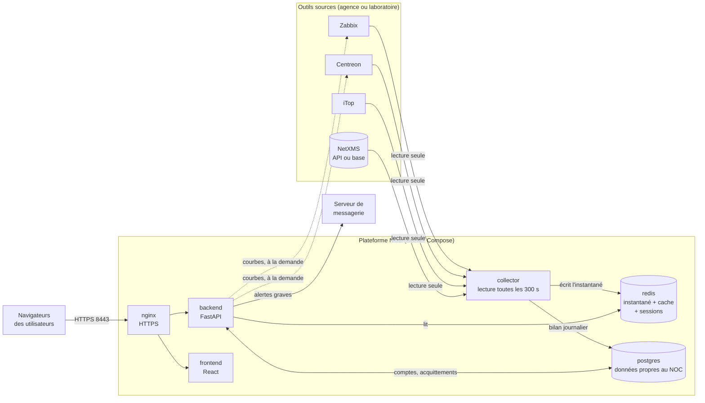
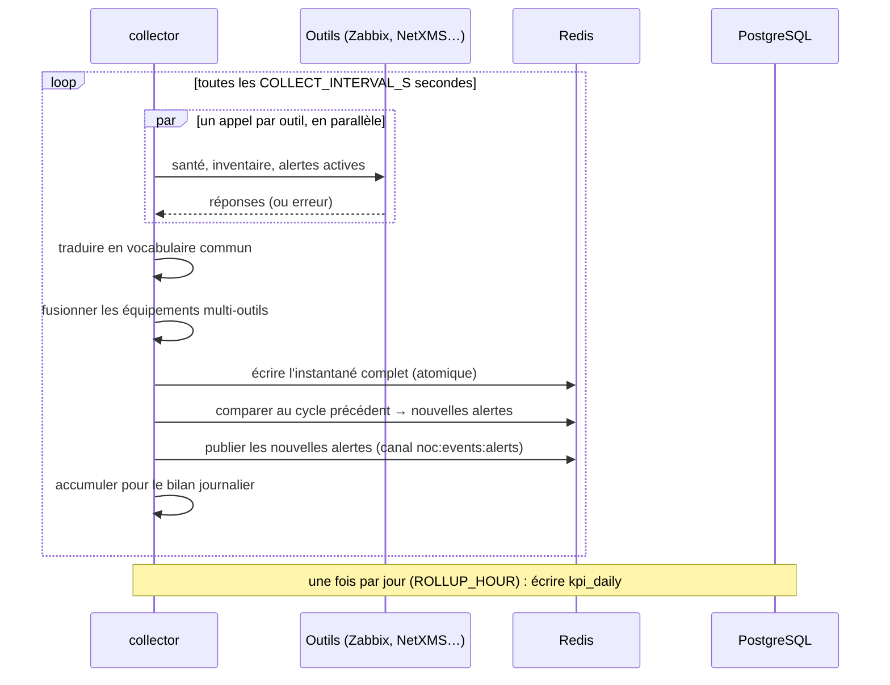
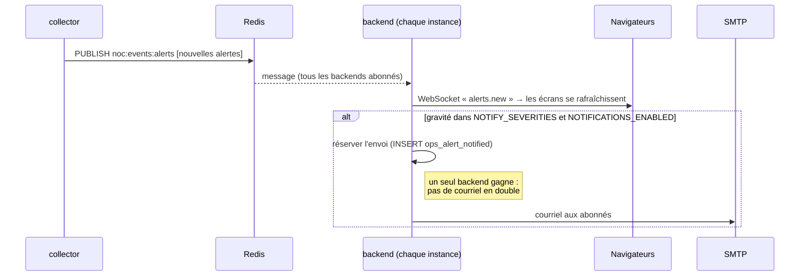

# 2. Architecture

> Ce chapitre décrit **comment** la plateforme est construite. Le **pourquoi**
> détaillé de chaque choix est dans [ARCHITECTURE.md](../ARCHITECTURE.md), à
> lire avant toute modification de fond.

## Vue d'ensemble

## Les conteneurs

Tout tourne dans Docker Compose (`docker-compose.yml`). Les services du **cœur**
démarrent avec `docker compose up` ; les autres sont dans des **profils**
lancés à la demande.

| Service | Rôle | Profil | Données persistées |
|---|---|---|---|
| `collector` | Lit les outils sources, publie l'instantané dans Redis, écrit le bilan journalier | cœur | — |
| `redis` | Instantané du parc et des alertes, cache des courbes, sessions de connexion | cœur | volume `redisdata` |
| `postgres` | Base du NOC : comptes, travail d'exploitation, agrégats journaliers | cœur | volume `pgdata` ⚠️ |
| `backend` | API REST et WebSocket, notifications, rapports | cœur | volume `reports` |
| `frontend` | Interface web (fichiers statiques servis par nginx interne) | cœur | — |
| `nginx` | Passerelle HTTPS : `/api` et `/ws` vers le backend, le reste vers le frontend | cœur | — |
| `netxms-db` | Base NetXMS restaurée depuis le dump de production | `netxms` | volume `netxms_pgdata` |
| `mailpit` | Faux serveur SMTP de test | `mail` | — |
| `zabbix-*` | Zabbix 7.0.23 de laboratoire (base, serveur, web, agent) | `zabbix`, `tools` | volume `zabbix_pgdata` |
| `itop`, `itop-db` | iTop 3.2.3 de laboratoire | `itop`, `tools` | volumes `itop_*` |
| `centreon`, `centreon-db` | Centreon 22.10.7 de laboratoire | `centreon`, `tools` | volumes `centreon_*` |
| `provision` | Tâche ponctuelle : déclare les machines à superviser dans les outils de laboratoire | `provision` | — |

Le volume `pgdata` est **le seul dont la perte est grave** : il contient ce
qu'aucun outil ne saurait redonner (comptes, acquittements, causes).

## Le principe fondateur : qui possède quelle donnée

Toute l'architecture découle d'une règle : **on ne persiste que ce qu'aucun
outil source ne saurait nous redonner.**

| Famille | Exemples | Propriétaire | Où elle vit dans le NOC |
|---|---|---|---|
| **État instantané** | équipements, leur état, alertes actives, santé des outils | l'outil source | **Redis**, réécrit en entier à chaque cycle, expire au bout de 3 cycles |
| **Historique** | courbes de mesures, incidents clos, tickets résolus | l'outil source | **nulle part** : demandé à l'outil au moment où on l'affiche, puis mis en cache |
| **Données propres au NOC** | comptes, acquittements, affectations, causes, notes, maintenances, interventions, incidents manuels, cibles SLA | **le NOC** | **PostgreSQL** |

Conséquences concrètes :

- La base PostgreSQL est **petite** (quelques Mo) : pas de métriques, pas
  d'historique d'alertes.
- Un équipement retiré d'un outil **disparaît** du NOC au cycle suivant.
- Si la collecte s'arrête, les écrans affichent **« collecte interrompue »**
  plutôt qu'un parc faussement calme.
- La version précédente du projet recopiait tout dans un entrepôt
  (TimescaleDB, tables `dim_*`/`fact_*`) ; elle a été abandonnée pour cette
  raison. On en trouve encore des traces (voir [chapitre 10](10-etat-du-projet.md)).

## Les flux, un par un

### Flux 1 — Le cycle de collecte (toutes les 300 s)

Points clés (code : `collector/cycle.py`) :

- **Un outil en panne n'empêche pas les autres** : chacun est interrogé dans sa
  propre tâche.
- **Le cycle est borné dans le temps** (`COLLECT_CYCLE_TIMEOUT_S`) : un outil
  qui ne répond pas est abandonné pour ce cycle.
- **Un instantané partiel est publié**, jamais un instantané vide : si Zabbix
  répond et Centreon non, le parc Zabbix s'affiche et Centreon est signalé en
  panne.
- **Au premier démarrage, rien n'est diffusé** : toutes les alertes seraient
  « nouvelles » et l'équipe recevrait des centaines de courriels.
- **Un seul collecteur** doit tourner. En lancer deux doublerait la charge sur
  la production sans rien accélérer.

### Flux 2 — L'affichage d'un écran

Le navigateur appelle l'API (`/api/overview`, `/api/alerts`, `/api/nodes`…).
Le backend lit **Redis uniquement** (`backend/app/services/live_service.py`) :
quelques microsecondes, quel que soit le nombre d'opérateurs connectés. Les
écrans se rafraîchissent toutes les 20 à 60 secondes, et le WebSocket les
réveille dès qu'une nouvelle alerte arrive.

Pour les alertes, le backend **assemble trois sources**
(`backend/app/services/alerts_service.py`) : les alertes de l'instantané, les
incidents manuels, et le travail du NOC sur chacune (acquittement,
affectation, cause) stocké dans PostgreSQL.

### Flux 3 — Une nouvelle alerte grave

Détails : [chapitre 6](06-alertes-et-notifications.md).

### Flux 4 — Une courbe (historique à la demande)

Quand un utilisateur ouvre la courbe de latence d'un équipement, le backend
**interroge l'outil source** (`history.get`/`trend.get` chez Zabbix, par
exemple) et met la réponse en cache dans Redis
(`backend/app/services/history_service.py`). Les utilisateurs suivants qui
ouvrent la même courbe sont servis par le cache. Si l'outil est injoignable,
l'écran le dit explicitement au lieu d'afficher une courbe vide.

### Flux 5 — Le bilan journalier

Le collecteur accumule, cycle après cycle, le nombre d'équipements, de pannes
et d'alertes par site. Une fois par jour, il écrit **une ligne par jour et par
site** dans la table `kpi_daily` (`collector/rollup.py`). Ce sont ces agrégats
qui permettent au tableau Direction d'afficher des tendances sur plusieurs
mois sans interroger les outils sur toute la période.

## Le contrat Redis

Le collecteur écrit, le backend lit. Les noms de clés sont définis **à un seul
endroit** : `collector/state.py`, que les deux services importent.

| Clé | Contenu | Durée de vie |
|---|---|---|
| `noc:live:nodes` | tous les équipements, fusionnés | 3 × `COLLECT_INTERVAL_S` |
| `noc:live:alerts` | toutes les alertes actives | 3 × `COLLECT_INTERVAL_S` |
| `noc:live:meta` | horodatage et statistiques du dernier cycle, rapport de fusion | 3 × `COLLECT_INTERVAL_S` |
| `noc:live:alerts:seen` | clés des alertes du cycle précédent (détection des nouveautés) | 3 × `COLLECT_INTERVAL_S` |
| `noc:tool:<outil>` | santé d'un outil : joignable, latence, version, dernière erreur | 3 × `COLLECT_INTERVAL_S` |
| `noc:hist:<empreinte>` | courbe mise en cache | proportionnelle à la fenêtre demandée |
| `noc:events:alerts` | canal de publication des nouvelles alertes | — |
| `refresh:*`, `refresh_user:*` | sessions de connexion (jetons de rafraîchissement) | 7 jours |
| `auth_failures:*`, `auth_locked:*` | verrouillage après échecs de connexion (mot de passe par compte et par adresse, PIN par adresse) | 15 min |
| `access_revoked_before:*` | instant avant lequel les jetons d'accès d'un compte sont refusés | 31 min |

Une clé d'instantané **absente** signifie « la collecte ne tourne plus » ; une
liste **vide** signifie « la collecte tourne et ne trouve rien ». Le code
distingue soigneusement les deux.

## Principes à respecter en faisant évoluer le projet

1. **Ne pas recopier les données des outils sources.** Si un besoin semble
   l'exiger, se demander d'abord si l'outil ne peut pas le fournir à la
   demande, ou si un agrégat journalier suffit.
2. **La charge sur la production est constante et connue d'avance** : une
   requête par outil par cycle, quel que soit le nombre d'utilisateurs. Ne
   jamais ajouter d'appel vers un outil déclenché par un rafraîchissement
   automatique d'écran.
3. **Lecture seule envers la production.** Les connecteurs ne modifient rien
   chez les outils (le NOC acquitte chez lui, pas dans Zabbix).
4. **Un outil s'active par son URL.** Pas de liste d'outils à tenir ailleurs.
5. **Un seul collecteur**, autant de backends que nécessaire.
6. **Dire plutôt que deviner** : une donnée absente s'affiche « — » ou « non
   collectée », jamais inventée. Un site inconnu reste inconnu.
