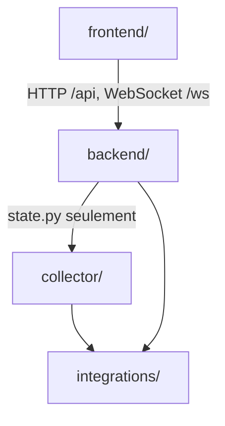

# 3. Organisation du code

## L'arborescence

```text
noc/
├── README.md                  Installer et lancer
├── ARCHITECTURE.md            Le raisonnement derrière l'architecture
├── docs/                      Cette documentation
├── docker-compose.yml         Tous les services, cœur et profils
├── .env.example               Toutes les variables, commentées (copier en .env)
├── deployment.sh              Mise à jour : down + up --build (sans perte de données)
│
├── collector/                 SERVICE — lit les outils, publie l'instantané
│   ├── __main__.py            Boucle principale, cadence calée sur l'horloge
│   ├── config.py              Variables du collecteur
│   ├── cycle.py               Un cycle : interroger, fusionner, publier
│   ├── merge.py               Fusion des équipements multi-outils
│   ├── state.py               Contrat Redis (noms de clés) — partagé avec le backend
│   └── rollup.py              Bilan journalier (kpi_daily)
│
├── integrations/              BIBLIOTHÈQUE — un connecteur par outil (collecteur + backend)
│   ├── base.py                Contrat commun, client HTTP, disjoncteur
│   ├── config.py              Quel connecteur instancier, selon <OUTIL>_API_URL
│   ├── models.py              Vocabulaire commun : Node, Alert, ToolHealth…
│   ├── normalize.py           Traduction des gravités et des dates de chaque outil
│   ├── zabbix.py  centreon.py  itop.py  nagios.py  nsp.py
│   ├── netxms.py              NetXMS par son API Web
│   └── netxms_db.py           NetXMS par sa base, en lecture seule
│
├── backend/                   SERVICE — API FastAPI
│   ├── app/
│   │   ├── main.py            Démarrage, contrôles, abonnement temps réel
│   │   ├── core/              Configuration, sessions (Redis), limitation de débit
│   │   ├── db/                Connexions PostgreSQL et Redis
│   │   ├── dependencies/      Authentification et contrôle des rôles
│   │   ├── models/            Tables PostgreSQL (SQLAlchemy)
│   │   ├── schemas/           Formats d'entrée/sortie de l'API (Pydantic)
│   │   ├── routes/            Les points d'entrée de l'API
│   │   └── services/          La logique métier
│   ├── sql/schema.sql         Schéma de la base du NOC (rejouable)
│   ├── scripts/create_user.py Création/réinitialisation de compte en ligne de commande
│   └── tests/                 ⚠️ obsolète (voir chapitre 10)
│
├── frontend/                  SERVICE — interface React
│   └── src/
│       ├── App.jsx            Routage et gardes de permission
│       ├── api/               Appels HTTP (noc.js = tout le contrat d'API)
│       ├── hooks/             Requêtes et cadences (queries.js), temps réel, session
│       ├── lib/               Permissions, vocabulaire, formatage
│       ├── store/             État global (session, préférences)
│       ├── components/        Briques d'interface (layout, ui, charts, domain)
│       └── pages/             Un fichier par écran
│
├── nginx/                     SERVICE — passerelle HTTPS
│   ├── nginx.conf             Routage /api, /ws, /
│   └── generate_cert.sh       Certificat auto-signé (certs/ exclu de git)
│
├── database/                  Base NetXMS de production (dump)
│   ├── restore_netxms_dump.sh Restauration + purge + compte de lecture
│   ├── netxms_sanitize.sql    Purge des secrets du dump
│   ├── netxms_readonly_role.sql Compte noc_reader (aussi : la demande de droits à l'agence)
│   └── netxmsbd07082026.sql   Le dump (exclu de git, à copier à la main)
│
└── tools/                     Outils de laboratoire (Zabbix, iTop, Centreon)
    ├── README.md
    ├── centreon/  itop/       Images Docker construites localement
    └── provision/             Déclaration des machines à superviser
```

## Qui dépend de qui



`integrations/` et `collector/state.py` sont **copiés dans les deux images**
(collecteur et backend) : c'est pourquoi le contexte de construction Docker est
la racine du dépôt et non le dossier de chaque service.

## Où modifier pour…

| Je veux… | Fichiers à toucher | Chapitre |
|---|---|---|
| Ajouter ou modifier un **écran** | `frontend/src/pages/`, route dans `App.jsx`, entrée de menu dans `components/layout/SideNav.jsx` | [8](08-frontend.md) |
| Ajouter une **route d'API** | `backend/app/routes/` (+ `services/`, `schemas/`), puis `frontend/src/api/noc.js` | [7](07-backend.md) |
| Changer **qui a le droit** de faire une action | Le tuple de rôles dans la route backend **et** `frontend/src/lib/permissions.js` | [5](05-comptes-roles-securite.md) |
| Ajouter un **champ à un compte** | `backend/sql/schema.sql` (avec `ALTER TABLE … ADD COLUMN IF NOT EXISTS`), `models/operations.py`, `schemas/users.py`, `services/user_service.py`, écrans Utilisateurs / Mon compte | [7](07-backend.md) |
| Brancher un **nouvel outil** | Un fichier dans `integrations/`, une branche dans `integrations/config.py`, sa table de gravités dans `normalize.py`, ses variables dans `docker-compose.yml` et `.env.example` | [4](04-sources-de-donnees.md) |
| Changer la **traduction des gravités** | `integrations/normalize.py` | [4](04-sources-de-donnees.md) |
| Changer les règles de **fusion** des équipements | `collector/merge.py` | [4](04-sources-de-donnees.md) |
| Modifier le **contenu des courriels** | `backend/app/services/notification_service.py` | [6](06-alertes-et-notifications.md) |
| Ajouter une **variable de configuration** | `backend/app/core/config.py` (ou `collector/config.py`), `docker-compose.yml` (section `environment` du service), `.env.example` | [9](09-exploitation.md) |
| Modifier le **rapport mensuel** | `backend/app/services/report_service.py` | [7](07-backend.md) |
| Changer la **cadence** de rafraîchissement d'un écran | `frontend/src/hooks/queries.js` (constantes `REFRESH`) | [8](08-frontend.md) |

## Conventions de code

- **Langue** : identifiants en anglais, commentaires, messages et documentation
  en français.
- **Les commentaires expliquent pourquoi**, avec les pannes que le choix évite.
  Avant de « simplifier » un bloc qui paraît excessif, lire son commentaire :
  il raconte généralement un incident réel.
- **Python** : 3.12, style vérifié par `ruff` (lignes de 100 colonnes,
  configuration dans `backend/pyproject.toml`).
- **JavaScript** : React avec composants fonctionnels, style vérifié par
  `oxlint` (`npm run lint`).
- **Scripts shell** : bash, fins de ligne LF imposées par `.gitattributes`.
