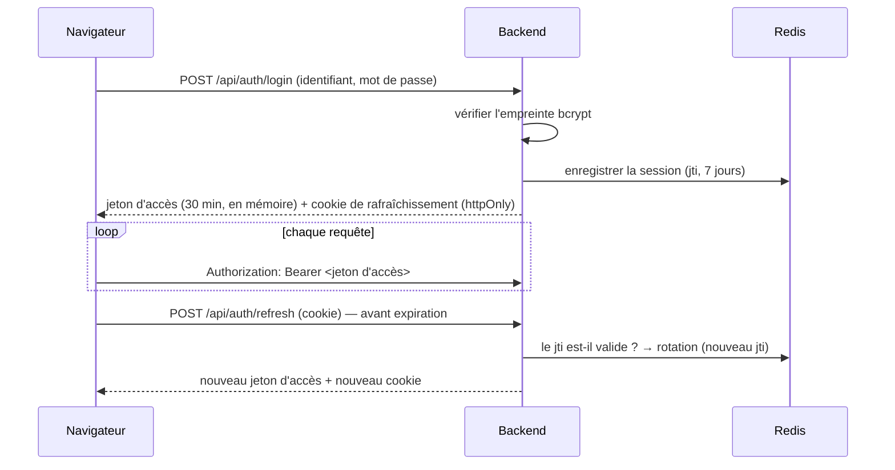

# 5. Comptes, rôles et sécurité

## Les quatre rôles

| Rôle (code) | Libellé | Vocation |
|---|---|---|
| `directeur` | Directeur | Pilotage : indicateurs, SLA, rapports |
| `chef_noc` | Chef NOC | Salle de supervision : répartition du travail, maintenances, **gestion des comptes** |
| `technicien` | Technicien NOC | Traitement des alertes |
| `agent_terrain` | Agent terrain | Interventions sur site, signalement de pannes |

Un rôle est défini à **trois endroits qui doivent rester identiques** :
`backend/app/core/config.py` (`VALID_ROLES`), `backend/app/schemas/users.py`
(`RoleEnum`) et `frontend/src/lib/permissions.js` (`ROLES`).

## Qui peut faire quoi

**La seule autorisation qui compte est celle du backend.** Chaque route vérifie
le rôle (`require_role(...)` dans `backend/app/dependencies/auth.py`). Le
fichier `frontend/src/lib/permissions.js` ne sert qu'à masquer les boutons
inutiles ; il ne protège rien.

Droits réellement appliqués par le backend :

| Action | Directeur | Chef NOC | Technicien | Agent terrain |
|---|:---:|:---:|:---:|:---:|
| Consulter l'état du réseau, les alertes, les équipements, les SLA | ✅ | ✅ | ✅ | ✅ |
| Acquitter, affecter, résoudre une alerte | ✅ | ✅ | ✅ | — |
| Ajouter une note à une alerte | ✅ | ✅ | ✅ | ✅ |
| Signaler / clore un incident manuel | ✅ | ✅ | ✅ | ✅ |
| Créer / supprimer une fenêtre de maintenance | ✅ | ✅ | — | — |
| Modifier les cibles SLA | ✅ | ✅ | — | — |
| Programmer une intervention terrain | ✅ | ✅ | ✅ | — |
| Faire avancer une intervention, rendre compte | ✅ | ✅ | ✅ | ✅ |
| Télécharger le rapport mensuel | ✅ | ✅ | — | — |
| **Créer un compte, attribuer un rôle, désactiver, réinitialiser un mot de passe ou un PIN** | — | ✅ | — | — |
| Couper les sessions d'un utilisateur | — | ✅ | — | — |
| Consulter et tester la configuration des courriels | — | ✅ | — | — |
| **Modifier ses propres identifiants** (identifiant, nom, téléphone, courriel, mot de passe, abonnement aux alertes) | ✅ | ✅ | ✅ | ✅ |
| Modifier **son propre rôle** | — | — | — | — |

> Quelques écarts existent entre ce tableau et ce que l'interface affiche (par
> exemple, l'interface propose au technicien de créer une maintenance, que le
> backend refuse). Ils sont listés au [chapitre 10](10-etat-du-projet.md).

## La gestion des comptes

### Le premier compte

Au premier démarrage, la base est vide et l'API exige d'être connecté en Chef
NOC pour créer un compte. Le script `backend/scripts/create_user.py` casse
cette boucle :

```bash
docker compose exec backend python scripts/create_user.py -u chefnoc -r chef_noc -n "Chef NOC" -p "…"
```

Il sert aussi au dépannage : `--reset-password`, `--list`, et `--role-set`
(un compte par rôle, pour une recette).

### Ensuite, tout se fait dans l'interface

- **Le Chef NOC** (écran *Utilisateurs*) crée les comptes avec un mot de passe
  provisoire, attribue et change les rôles, réinitialise un mot de passe
  oublié, définit le PIN d'un agent terrain, désactive un compte, et choisit
  qui reçoit les alertes par courriel.
- **Chaque utilisateur** (écran *Mon compte*) modifie ses identifiants. Changer
  d'identifiant exige de saisir son mot de passe actuel.

### Règles de protection

| Règle | Raison |
|---|---|
| Un compte n'est **jamais supprimé**, seulement désactivé | Supprimer effacerait la traçabilité « qui a résolu cet incident ». |
| Un Chef NOC ne peut **ni changer son propre rôle, ni se désactiver** | Le dernier Chef NOC laisserait sinon la plateforme sans personne pour gérer les comptes. |
| Changer un rôle, désactiver un compte ou réinitialiser son mot de passe **coupe ses sessions** | Les droits changent immédiatement, sans attendre l'expiration des jetons. |
| Changer son mot de passe **ferme toutes ses sessions**, y compris l'actuelle | Geste attendu en cas de soupçon de compromission. |
| Le rôle est **relu en base à chaque requête** | Un compte rétrogradé ne garde pas ses anciens droits jusqu'à la fin de sa session. |

## L'authentification



| Élément | Détail |
|---|---|
| Mots de passe | Empreinte **bcrypt**, 8 caractères minimum. |
| Jeton d'accès | JWT signé avec `SECRET_KEY`, 30 minutes (`ACCESS_TOKEN_EXPIRE_MINUTES`), gardé **en mémoire** par le navigateur, jamais dans le stockage local. |
| Jeton de rafraîchissement | JWT de 7 jours dans un cookie `httpOnly` limité à `/api/auth`. Chaque utilisation le remplace ; **réutiliser un ancien jeton coupe toutes les sessions du compte** (signe de vol). |
| Sessions | Enregistrées dans Redis : c'est ce qui permet de les révoquer. |
| Connexion par PIN | Réservée aux **agents terrain** (confort sur téléphone). 4 à 6 chiffres. Après **5 échecs**, l'adresse IP est bloquée **15 minutes**. Le PIN est un facteur faible, jamais disponible pour les autres rôles. |
| WebSocket | Le jeton est envoyé dans la **première trame**, pas dans l'URL (qui finirait dans les journaux du proxy). |
| Transport | HTTPS par nginx (TLS 1.2 et 1.3). `REFRESH_COOKIE_SECURE=true` dès qu'on est en HTTPS. |

## Les données sensibles du projet

| Donnée | Où | Protection |
|---|---|---|
| Secrets de configuration (`SECRET_KEY`, mots de passe des bases, des outils, du SMTP) | `.env` | Exclu de git. Ne jamais le copier d'un environnement à l'autre : chaque environnement a ses propres secrets. |
| Dump NetXMS de production | `database/netxmsbd07082026.sql` | Exclu de git ; secrets purgés à la restauration ; base accessible sur `127.0.0.1` seulement. |
| Certificat TLS et sa clé | `nginx/certs/` | Exclu de git. |
| Comptes et travail d'exploitation | volume Docker `pgdata` | À sauvegarder régulièrement (chapitre 9). |

## Points d'attention avant une exposition réseau

- **Ports internes publiés** : `docker-compose.yml` publie la base du NOC
  (`5436`) et le backend (port aléatoire) sur toutes les interfaces. Sur un
  serveur, ne laisser ouvert que nginx (443 ou 8443). Attention : sous Linux,
  Docker contourne le pare-feu `ufw` ; il faut restreindre la publication dans
  le fichier Compose lui-même (`127.0.0.1:5436:5432`).
- **Certificat** : le certificat auto-signé est émis pour `noc.anptic.bf` et
  `localhost` ; le remplacer par un certificat de l'autorité de l'agence.
- **Limitation de débit** : écrite (`backend/app/core/rate_limit.py`) mais
  **pas encore branchée** sur les routes.
