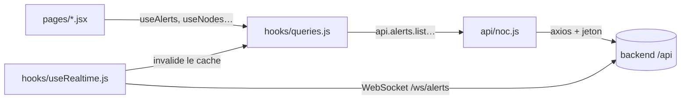

# 8. Frontend (interface)

## Technologies

| Besoin | Bibliothèque |
|---|---|
| Interface | React, construit par Vite |
| Routage | React Router 7 |
| Données serveur, cache, rafraîchissement | TanStack Query 5 |
| État global (session, préférences) | Zustand |
| Styles | Tailwind CSS et variables CSS (thème sombre et clair) |
| Graphiques | Chart.js |
| Icônes | lucide-react |
| Application installable, notifications | PWA (vite-plugin-pwa, `src/sw.js`) |
| Qualité du code | oxlint (`npm run lint`) |

En production, les fichiers construits sont servis par un nginx interne au
conteneur `frontend`, lui-même derrière la passerelle `nginx`.

## Structure de `frontend/src/`

| Dossier / fichier | Contenu |
|---|---|
| `App.jsx` | Routes, écran d'accueil par rôle, gardes de permission |
| `api/client.js` | Client HTTP : ajoute le jeton, renouvelle la session sur une 401 |
| `api/noc.js` | **Tout le contrat d'API** en un fichier, miroir des routes du backend |
| `api/config.js` | URL de l'API (`/api`) et du WebSocket |
| `hooks/queries.js` | **Toutes les requêtes**, leurs cadences de rafraîchissement, et la couche de compatibilité |
| `hooks/useRealtime.js` | WebSocket : authentification, chien de garde, reconnexion |
| `hooks/useSession.js` | Restauration et maintien de la session |
| `store/auth.js` | Jeton (en mémoire) et utilisateur courant |
| `store/ui.js` | Thème, rafraîchissement automatique, période sélectionnée |
| `lib/permissions.js` | Rôles, libellés, permissions d'affichage, écran d'accueil par rôle |
| `lib/vocabulary.js` | Libellés et couleurs : gravités, états, outils, statuts |
| `lib/format.js` | Formatage des nombres, dates, durées |
| `components/layout/` | Coque : barre latérale, bandeau d'état, ticker d'alertes |
| `components/ui/` | Briques génériques : panneaux, tableaux, modales, badges, états de chargement |
| `components/domain/` | Briques métier : tableau d'incidents, fiche d'incident, carte, indicateurs réseau |
| `pages/` | Un fichier par écran |

## Les écrans

| Route | Fichier | Visible par |
|---|---|---|
| `/connexion` | `LoginPage.jsx` | tous |
| `/direction` | `DirectionView.jsx` | directeur |
| `/supervision` | `SupervisionView.jsx` | directeur, chef NOC |
| `/console` | `ConsoleView.jsx` | chef NOC, technicien |
| `/terrain` | `TerrainView.jsx` | agent terrain, chef NOC, directeur |
| `/incidents` | `IncidentsPage.jsx` | directeur, chef NOC, technicien |
| `/equipements`, `/equipements/:id` | `NodesPage.jsx`, `NodeDetailPage.jsx` | tous |
| `/carte` | `MapPage.jsx` | tous |
| `/performance` | `PerformancePage.jsx` | tous |
| `/sla` | `SlaPage.jsx` | tous |
| `/integrations` | `IntegrationsPage.jsx` | directeur, chef NOC, technicien |
| `/maintenances` | `MaintenancePage.jsx` | directeur, chef NOC, technicien |
| `/rapports` | `ReportsPage.jsx` | directeur, chef NOC |
| `/utilisateurs` | `UsersPage.jsx` | chef NOC |
| `/compte` | `AccountPage.jsx` | tous |
| `/mur` | `WallboardPage.jsx` | tous (plein écran, sans menu) |

La visibilité est gérée par `lib/permissions.js`. **Ce n'est qu'un confort** :
le vrai contrôle est fait par le backend (chapitre 5).

## Comment un écran obtient ses données



Les requêtes sont regroupées par **régime de rafraîchissement** (constantes
`REFRESH` de `queries.js`) :

| Régime | Cadence | Pour |
|---|---|---|
| LIVE | 20 s | Alertes, parc, synthèse (lecture Redis, sans coût) |
| OPERATIONAL | 60 s | Inventaire, interventions, maintenances |
| ANALYTIC | 5 min | Tendances et SLA (agrégats journaliers) |
| ON_DEMAND | jamais automatique | **Courbes** : elles interrogent les outils de production |

Le WebSocket ne remplace pas ce rafraîchissement : il le déclenche plus tôt
quand une alerte arrive. Si la socket tombe sans prévenir, les écrans restent
justes grâce au sondage. L'utilisateur peut couper le rafraîchissement
automatique dans *Mon compte* (utile sur une liaison de secours).

## La couche de compatibilité — à connaître absolument

Les écrans ont été écrits pour **l'ancienne API** (celle de l'entrepôt de
données). Quand le backend a été refondu, ils n'ont pas été réécrits : la fin
de `hooks/queries.js` contient des **hooks de compatibilité** qui
reconstituent les anciennes formes de données à partir des nouvelles.

Exemples :

| Ancien écran attend | L'API renvoie | Adaptation |
|---|---|---|
| un incident avec `id`, `detected_at`, `status`, `description`, `locality` | une alerte avec `key`, `since`, `acknowledged`, `message`, `site` | `toIncident()` |
| `useKpiLocalities(8)` avec `locality`, `total_incidents` | `/kpi/sites` avec `site`, `avg_alerts` | renommage des champs |
| une courbe sous forme de liste de points | un objet `{ points, sampled_nodes, … }` | `useNetworkSeries` rend la liste |
| `actions.resolve({ id, notes })` | `POST /alerts/{clé}/resolve` avec `cause`, `note` | `useIncidentActions` traduit les arguments |

Conséquences pratiques :

- **Un écran qui plante avec « … is not a function » ou « Cannot read
  properties of undefined »** vient presque toujours d'un décalage entre ce que
  l'écran attend et ce que l'API renvoie. Comparer le champ lu par l'écran à la
  réponse réelle (onglet Réseau du navigateur), puis corriger l'adaptation dans
  `queries.js` ou l'écran.
- **Pour un nouvel écran, utiliser directement les hooks natifs** (en haut de
  `queries.js`) et les champs de la nouvelle API, pas les hooks de
  compatibilité.
- La cible à terme est de réécrire chaque écran sur les hooks natifs et de
  supprimer cette couche (chapitre 10).

Quand un écran plante, l'`ErrorBoundary` affiche « Cet écran n'a pas pu
s'afficher » et **le reste de l'application continue de fonctionner**.

## La session côté navigateur

- Le **jeton d'accès** ne vit qu'en mémoire (`store/auth.js`) : un script
  malveillant ne peut pas le lire dans le stockage local.
- Au chargement de la page, la session est **restaurée** par le cookie de
  rafraîchissement (`useSessionBootstrap`).
- Le jeton est **renouvelé 2 minutes avant son expiration** quand l'onglet est
  visible (`useSessionKeepAlive`), et sur toute réponse 401.

## Développer sur le frontend

**Boucle simple** (dans Docker) :

```bash
docker compose up -d --build frontend
```

**Avec rechargement instantané** (Node.js 20+ requis) :

```bash
cd frontend
npm install
npm run dev          # http://localhost:5173
```

Le serveur de développement relaie `/api` et `/ws` vers `http://localhost:8000`
(`vite.config.js`). Or le backend Docker publie un port **aléatoire** : le
trouver avec `docker compose port backend 8000` et adapter la cible du proxy,
ou publier `8000:8000` dans un `docker-compose.override.yml`.

Autres commandes : `npm run build` (construction), `npm run lint` (qualité).

## Ajouter un écran

1. Créer `src/pages/MonEcran.jsx`, en s'appuyant sur les briques de
   `components/ui/` (`Panel`, `QueryBoundary` pour les états chargement / erreur /
   vide, `DataTable`…).
2. Si une nouvelle donnée est nécessaire : route backend → fonction dans
   `api/noc.js` → hook dans `hooks/queries.js` avec la bonne cadence.
3. Déclarer la route dans `App.jsx`, avec une `Guard` si l'écran est réservé.
4. Ajouter la permission dans `lib/permissions.js` (copie exacte du tuple de
   rôles de la route backend) et l'entrée de menu dans
   `components/layout/SideNav.jsx`.
